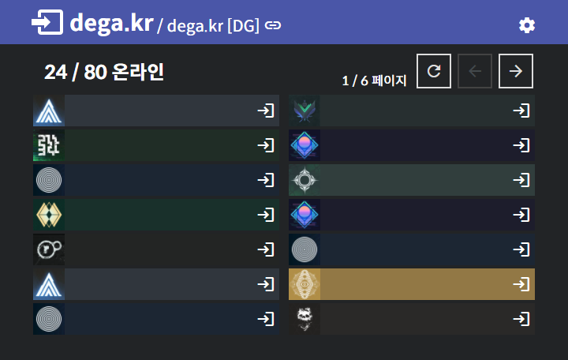

# dega.kr

데스티니 화력팀 합류 도우미

## Checklist
- [x] clone repo
- [x] virtual env setting / requirements install
- [x] set `API_KEY` file
- [x] nginx configuration
  - [x] write server conf file at `sites-available`
  - [x] generate symlink
  - [x] set log directory
- [x] systemd setting
  - [x] web server
  - [x] parser server
- [x] DNS setting (cloudflare)
- [x] bungie.net API origin header
- [x] Google Analytics tracker setting
- [x] Google search console
- [x] **commit `update-log.html`**

## TODO list
- [x] Change font (-> Spoqa Han Sans?)
- [x] Remake `/help`, `/faq` page
- [x] Case-insensitive clan search
- [x] enable ssl (using certbot / wildcard cert. / auto-renew)
